

# Numerically Controlled Oscillator (NCO) — Tone Generator Using the PIC16F18446 Microcontroller

In this project, the NCO peripheral generates a square-wave with variable frequency in the audible spectrum.
The POT1 potentiometer on the Curiosity Board adjusts the frequency. The potentiometer is read using the Analog-to-Digital Converter (ADC) peripheral.

## Related Documentation
- [PIC16F18446 Product Family Page](https://www.microchip.com/design-centers/8-bit/pic-mcus/device-selection/pic16f18446)
- [PIC16F18446 Data Sheet](http://ww1.microchip.com/downloads/en/DeviceDoc/40001985B.pdf)

## Software Used

- [MPLAB® X IDE](http://www.microchip.com/mplab/mplab-x-ide) v6.15 or newer
- [MPLAB® XC8](http://www.microchip.com/mplab/compilers) v2.45 or newer
- [PIC16F1xxxx_DFP](https://packs.download.microchip.com/) v1.21.368

## Hardware Used

- [Curiosity Development Board](https://www.microchip.com/Developmenttools/ProductDetails/DM164137)
   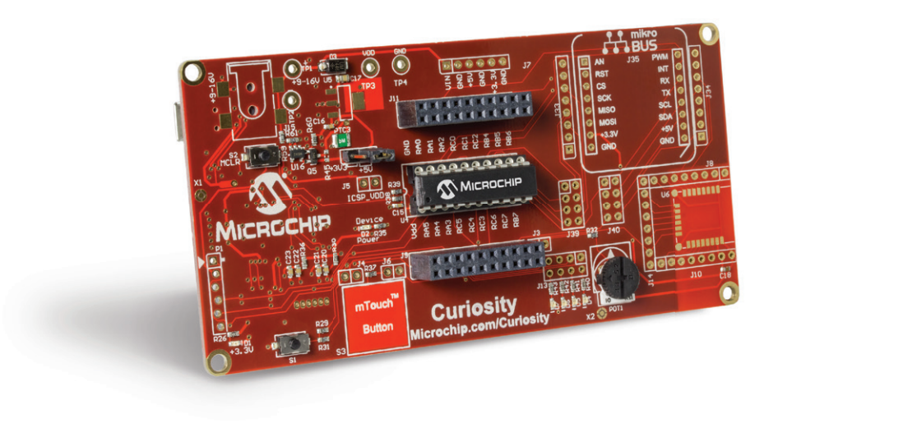

- [PIC16F18446 PDIP20](https://www.microchip.com/en-us/product/PIC16F18446)
   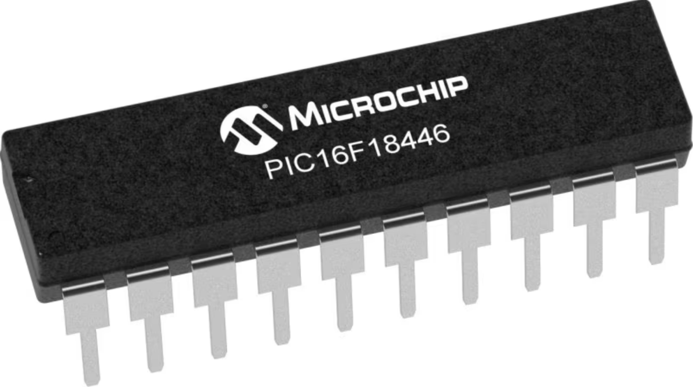

- [BUZZ CLICK board™](https://www.mikroe.com/buzz-click) (mikroBUS™ socket 1):
   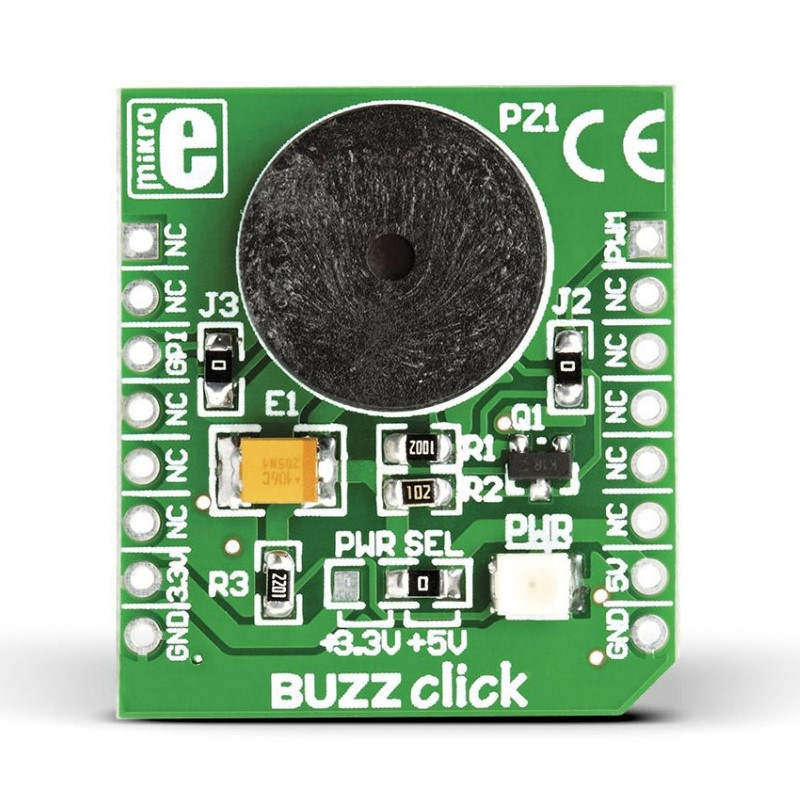
 

## Operation

To program the microcontroller with this MPLAB X project, follow the steps provided in the [How to Program the Microcontroller](#how-to-program-the-microcontroller) chapter.  

## Setup

The following configurations must be made for this project:

- Clock Control:
  - Clock Source: HFINTOSC
  - HF Internal Clock: 32 MHz
  - Clock Divider: 4

   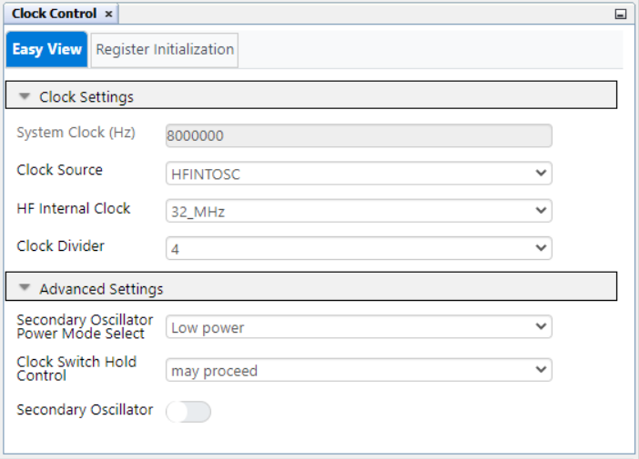

- Configuration bits:
  - WDT operating mode: WDT disabled

   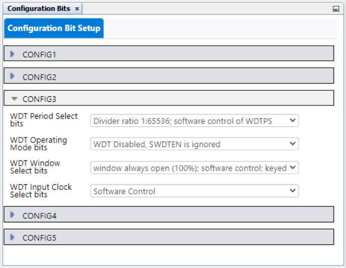

- NCO1:
  - Enable NCO: Yes
  - NCO Mode: FDC mode
  - Output polarity: Active high
  - Clock Source: FOSC
  - Requested NCO Output Frequency: 1000 Hz

   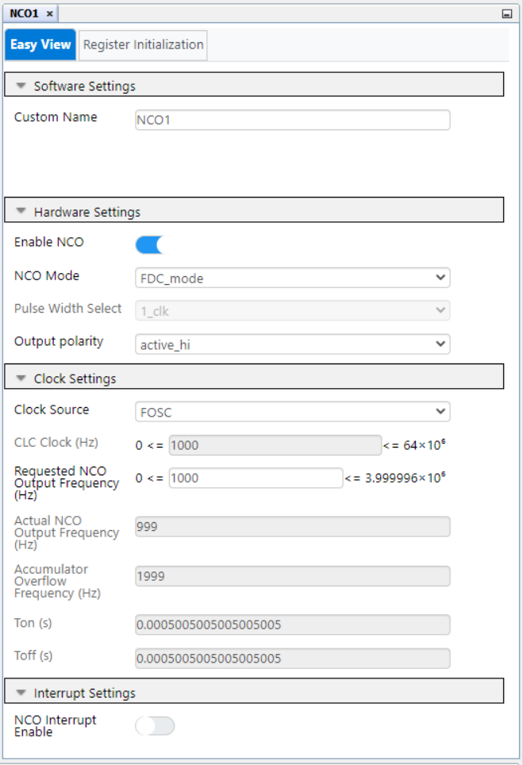

- ADCC:
  - Enable ADC: Yes
  - Operating Mode: Basic mode
  - Result Alignment: Right
  - Positive Input Channel: ANC0
  - Positive Reference: VDD
  - Negative Reference: VSS
  - Auto-conversion Trigger: Disabled
  - Acquisition Count: 1
  - Clock Source: FOSC
  - Clock Divider: FOSC/32

   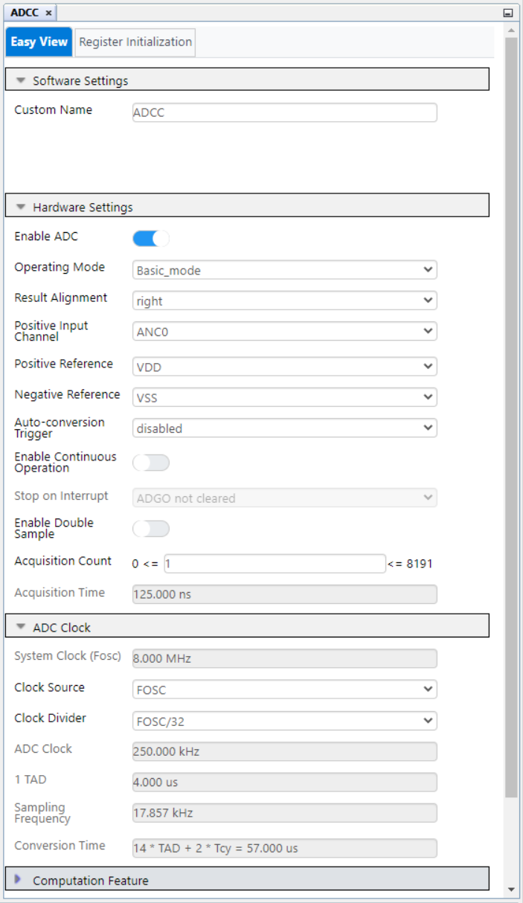

| Pin | Configuration  |        Description        |
| :-: | :------------: | :-----------------------: |
| RC0 |  Analog input  |        Potentiometer      |
| RC5 | Digital output |           Buzzer          |

 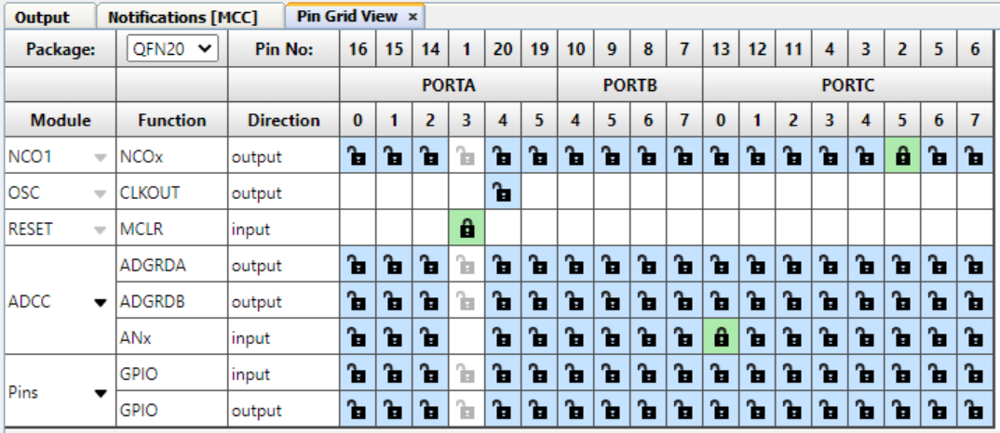
 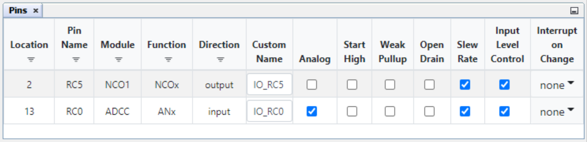

## Demo

Board setup:

 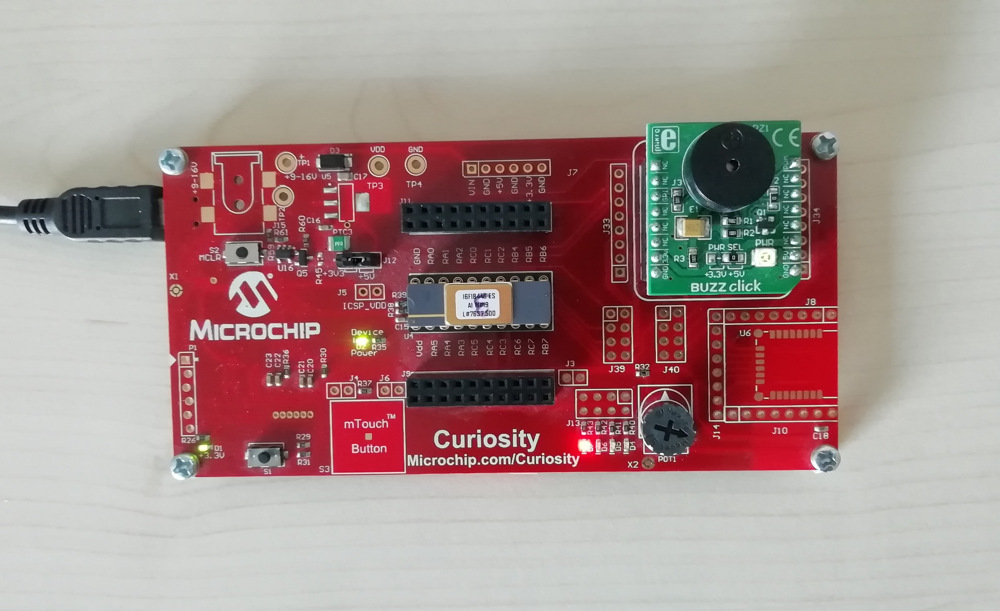

## Summary

This code example shows how to make a tone generator using the NCO and ADC peripherals.

## How to Program the Microcontroller

This chapter demonstrates how to use the MPLAB X IDE to program a PIC® device with an `Example_Project.X`. This applies to other projects.

1.  Connect the Curiosity Development board to the PC.

2.  Open the `Example_Project.X` project in MPLAB X IDE.

3.  Set the `Example_Project.X` project as main project.
     Right click the project in the **Projects** tab and then Set as Main Project.
     

4.  Clean and build the `Example_Project.X` project.
     Right click the `Example_Project.X` project and select Clean and Build.
     

5.  Select Starter Kits (PKOB) in the Connected Hardware Tool section of the project settings:
     Right click the project and **Properties**.
     Click the arrow under the Connected Hardware Tool, and from the dropdown, select Starter Kits (PKOB) by clicking the SN.
     Click **Apply** and then **OK**.
     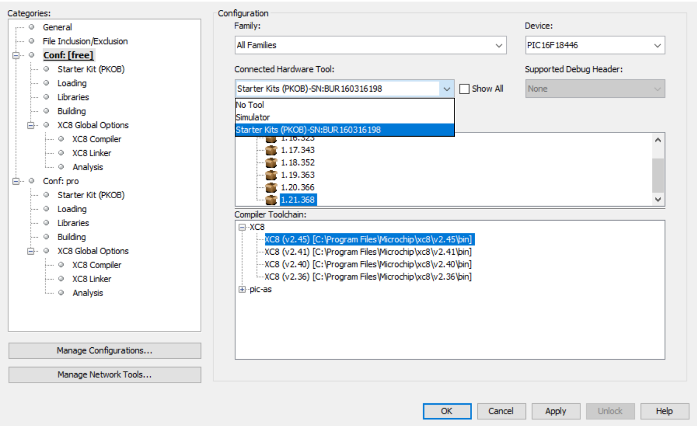

6.  Program the project to the microcontroller.
     Right click the project and then Make and Program Device.
     

 

- [Back to Top](#numerically-controlled-oscillator-nco--tone-generator-using-the-pic16f18446-microcontroller)
- [Back to Setup](#setup)
- [Back to Demo](#demo)
- [Back to Summary](#summary)